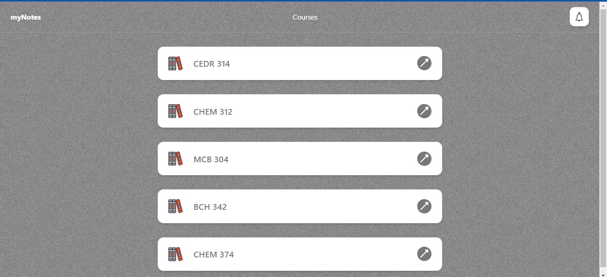

# 📚 **myNotes**

This is a question and answer app built with React ⚛️ and Firebase 🔥. This app was specifically designed to assist colleagues in their exam preparation by providing a convenient platform for studying and collaborative learning. Its features are tailored to enhance the studying experience and promote knowledge sharing among users. With this app, students can leverage its functionality to improve their understanding of course materials and excel in their exams.

## Upcoming Features

- 👤 User Registration: Users can create an account or sign in using their existing credentials.
- ❓ Ask Questions: Users can post their questions on different topics.
- 💡 Answer Questions: Users can provide answers and contribute to existing discussions.
- 👍 Upvote and Downvote: Users can vote on questions and answers to highlight the most helpful content.
- 🔄 Real-Time Updates: The app utilizes Firebase's real-time database to ensure instant updates and synchronization across multiple users.


## Technologies Used

- ⚛️ React: A JavaScript library for building user interfaces.
- 🔥 Firebase: A platform that provides various services, including authentication and real-time database.

## 🛠️ Getting Started

See the live view [**HERE**](https://mynotes-unn.netlify.app/)

To run the app locally, follow these steps:

1. Clone the repository: `git clone https://github.com/Chucks1093/myNotes.git`
2. Install dependencies: `npm install`
3. Configure Firebase:
   - Create a Firebase project on the 🌐 [Firebase console](https://console.firebase.google.com/).
   - Enable authentication and set up the desired sign-in methods.
   - Set up the Firebase real-time database.
   - Copy the Firebase configuration details.

4. Start the development server: `npm run dev`
   

<!-- 
## 📂 Folder Structure

```
├── public/          # Static files and HTML template
├── src/             # Source code
│   ├── components/  # React components
|   ├──partials      # Scss partials
│   ├── firebase/    # Firebase configuration and utility functions
│   ├── pages/       # App pages and routing
│   ├── App.jsx       # Main app component
│   └── main.jsx     # App entry point
└── package.json     # Project dependencies and scripts
``` -->

## 📸Screenshot



## 🤝 Contributing

Contributions to enhance the question and answer app are welcome! If you have any ideas or improvements, feel free to open an issue or submit a pull request.


## 📧 Contact

If you have any questions or feedback, you can reach me at aniokechukwudi7@gmail.com.